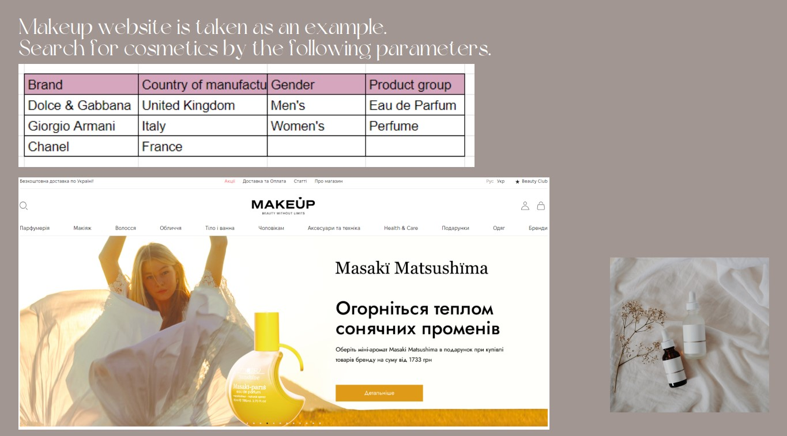
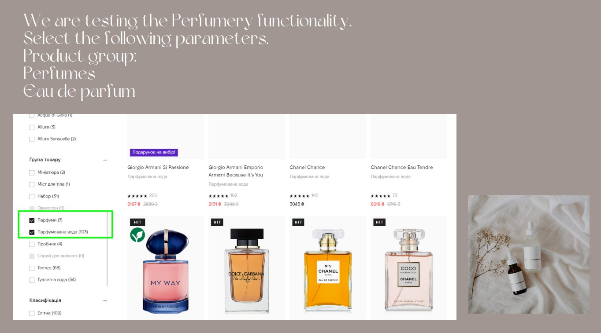
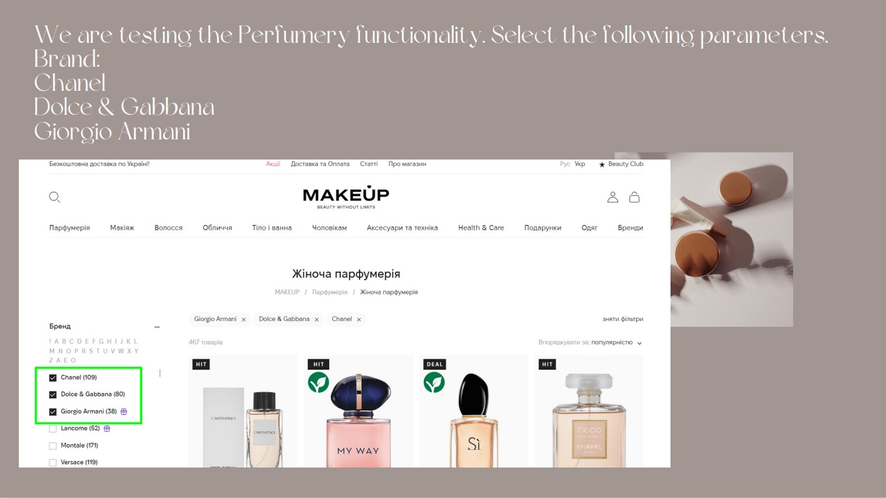
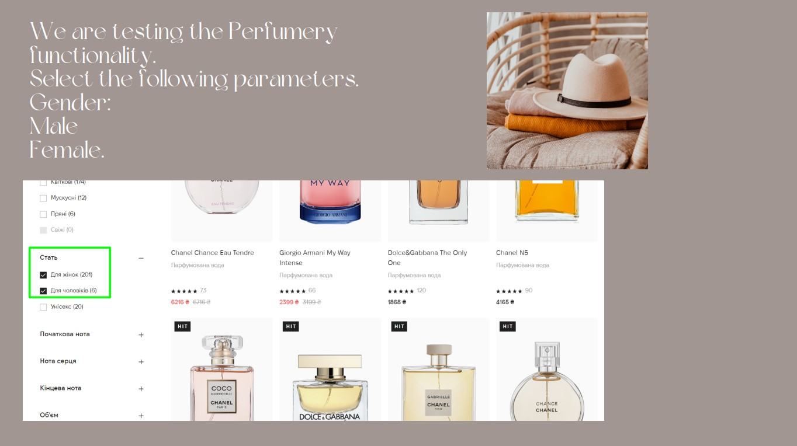
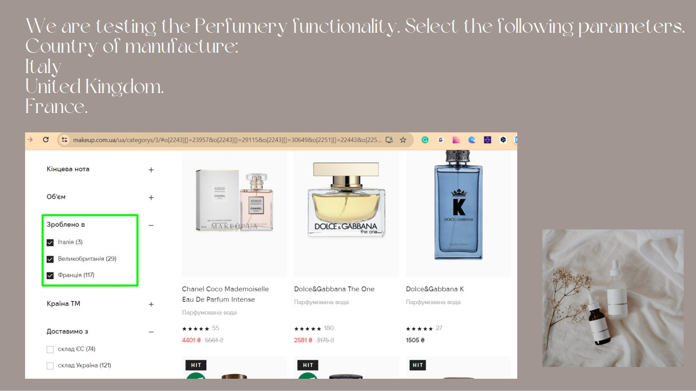
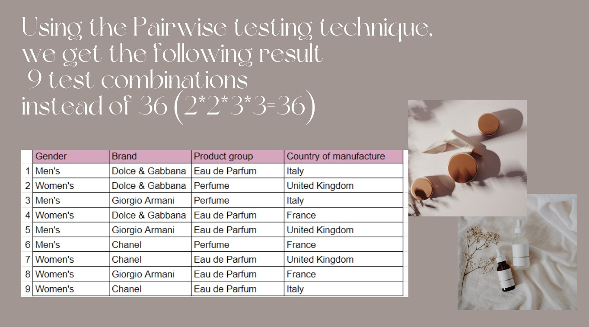
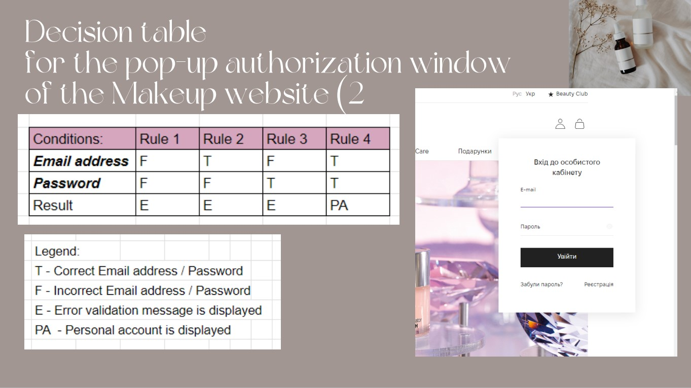
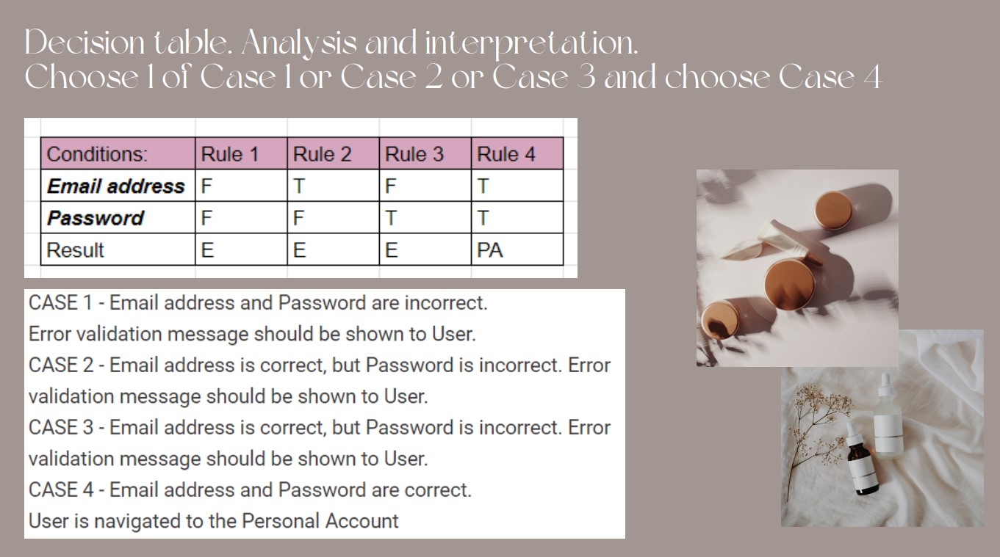
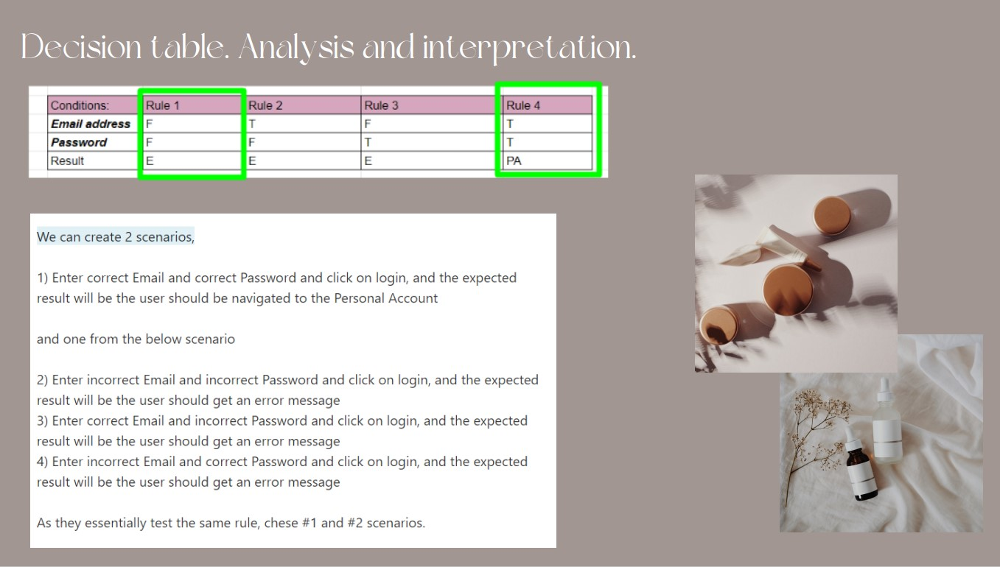

# Decision table and Pairwise testing
Manual Software Testing

 

## Don't forget to give a :star: to make the project popular :) 

## :boom: The task and what needs to be done?
- Choose a website with a different selection of input data.
- Use the Pairwise Testing technique in practice. 
- Use the Decision Table technique in practice. 
- Present the result of the work in the form of a .pdf document. 

 

## :bulb: The result:
- makeup .com .ua website with a different choice of input data was chosen for work.
- The Pairwise Testing technique was used in practice. 
- The Decision Table technique was used in practice. 
- The result of the work was formalized in the form of a .pdf document. 

### MAKEUP website is taken as an a example. Search cosmetics by the following parameters.

 

### We are testing the Perfumery functionality. Select the following parameters. Product group: Perfumes and Eau de parfum

 

### We are testing the Perfumery functionality. Select the following parameters. Brand: - Chanel and - Dolce & Gabbana and - Giorgio Armani

 

### We are testing the Perfumery functionality. Select the following parameters. Gender: - Male and - Female

 

### We are testing the Perfumery functionality. Select the following parameters. Country of manufacture: - Italy and - United Kingdom and - France

 

### Using the Pairwise testing technique, we get the following result: 9 test combinations instead of 36 (2*2*3*3=36)

 

### Decision table for the pop-up authorization window of the Makeup website

 

### Decision table. Analysis and interpretation. Choose 1 of Case 1 or Case 2 or Case 3 and choose Case 4

 

### Decision table. Analysis and interpretation

 

